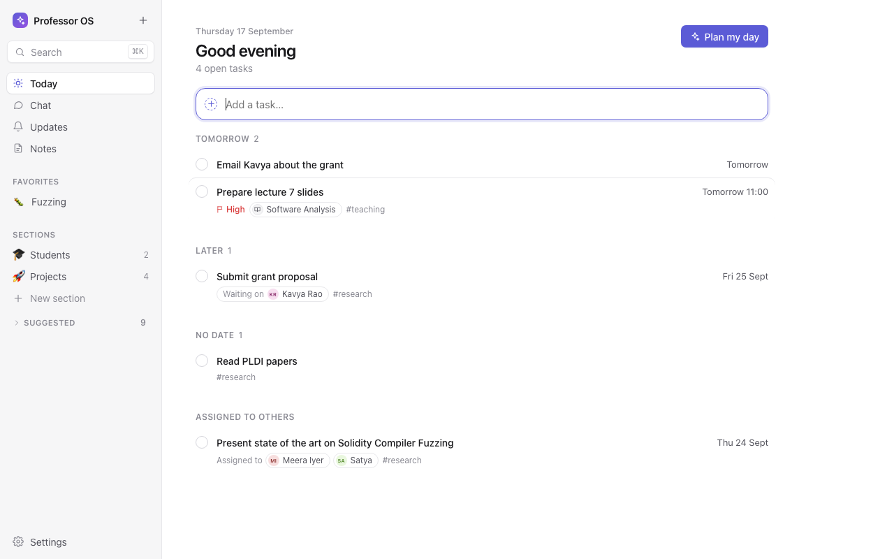
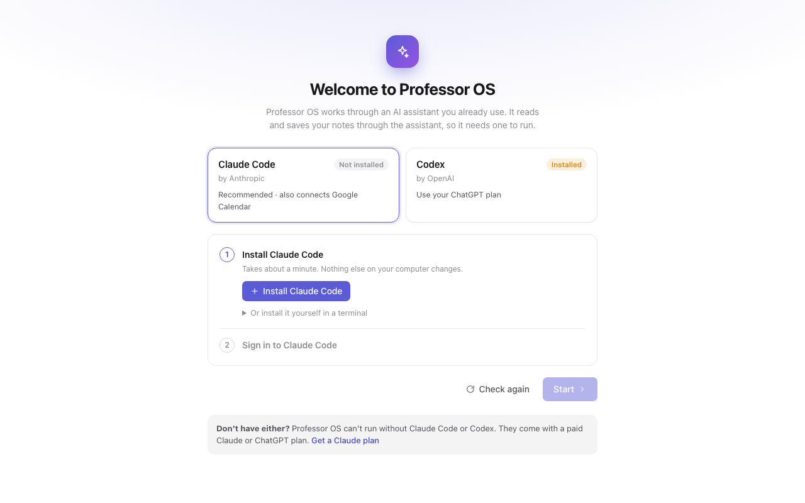
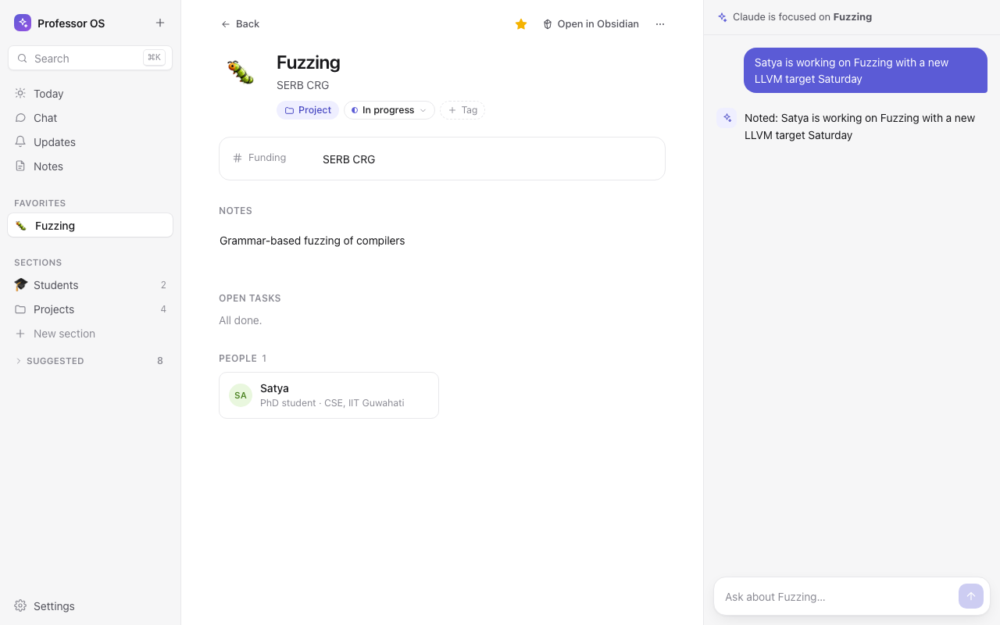
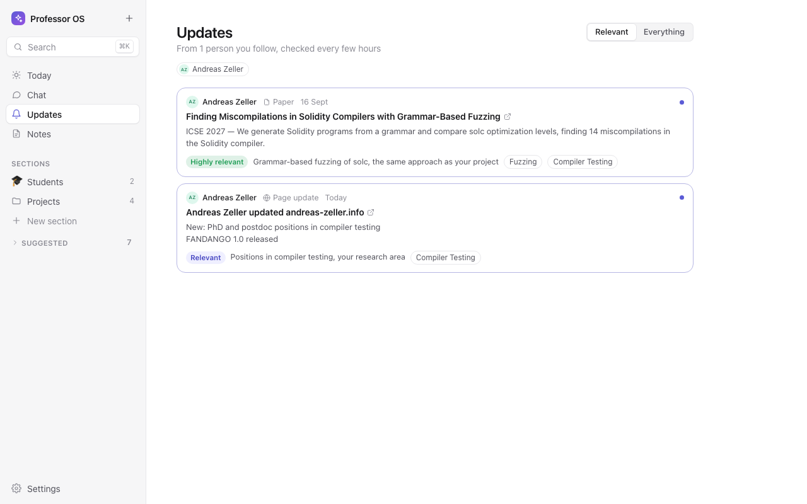

<p align="center">
  
</p>

<h1 align="center">Suk</h1>

<p align="center"><b>Tell it what's going on. It keeps your work in order.</b><br>
People, projects, tasks and notes in one calm place, on your own computer.</p>

<p align="center"><i>Suk</i> (Khasi) means peace, as in <i>Shad Suk Mynsiem</i>, the dance of peaceful hearts.</p>

<p align="center">
  
</p>

## Install

**macOS or Linux**, in a terminal:

```sh
curl -fsSL https://raw.githubusercontent.com/bernardnongpoh/suk/main/install.sh | sh
```

On macOS this puts Suk in Applications. On Ubuntu and Debian it installs the `.deb`
package, on Fedora and openSUSE the `.rpm`, and anywhere else the AppImage (use
`sh -s -- --appimage` to choose the AppImage yourself, without sudo).

Or download the file for your computer from the [latest release](https://github.com/bernardnongpoh/suk/releases/latest):

| Computer | File |
| --- | --- |
| Mac with Apple silicon (M1 or later) | `…_aarch64.dmg` |
| Mac with Intel | `…_x64.dmg` |
| Ubuntu / Debian | `…_amd64.deb` (or `_arm64.deb`) |
| Fedora / openSUSE | `….x86_64.rpm` (or `.aarch64.rpm`) |
| Other Linux | `…_amd64.AppImage` (or `_aarch64.AppImage`) |

> **macOS:** the app isn't signed with an Apple Developer ID yet. The install command above works
> without any warning. If you open the `.dmg` you downloaded instead, right-click Suk in
> Applications and choose **Open** the first time.

Requires macOS 13.3 or later, or 64-bit Linux: Ubuntu 24.04, Debian 13, Fedora 40 or later.

## You need Claude Code or Codex

Suk does its thinking through an AI assistant you already pay for. It can't run without
one:

- **[Claude Code](https://claude.com/code)** with a Claude Pro or Max plan (or an Anthropic
  Console account). Recommended: it can also add confirmed plans to Google Calendar.
- **[Codex](https://developers.openai.com/codex)** with a ChatGPT Plus, Pro, Business or
  Enterprise plan.

You don't need to set these up beforehand. The first time Suk opens, it installs the one
you choose and signs you in, in a couple of clicks.

<p align="center">
  
</p>

## What it does

- **Just say it.** "Met Rina from Acme today; she'll send the budget by Friday" creates her page,
  links her to the project, and adds the follow-up to your tasks. Paste a profile link and it fills
  in the details.
- **Pages for everything**: people (colleagues, collaborators, clients, students), projects
  (planned, in progress, completed), ideas, organizations and notes, each with an icon you pick.
- **Edit anything directly**: click a detail on any page to change it, clear it to remove it, or
  add one. You never have to go through chat, and the assistant is told what you changed.
- **Today**: your tasks by when they're due, quick add, and "Plan my day", which drafts a
  schedule you confirm before anything reaches your calendar.
- **Follow people's work**: new papers, homepage changes and blog or GitHub posts from people you
  follow, rated for how they relate to your own projects and ideas.
- **Search and commands** with ⌘K / Ctrl K, favorites, light and dark themes, accent colors.
- **Your files**: every page is a plain Markdown file in `~/Documents/Suk`. Open them in any
  editor, back them up, sync the folder with iCloud or Dropbox; edits you make there come back into
  Suk. Using [Obsidian](https://obsidian.md)? Open the folder as a vault and pages open there.

<p align="center">
  
  
</p>

## Made with academics in mind

Suk started as a tool for a university professor, and it shows. Tell it "Satya joined as my PhD
student, working on compiler fuzzing" and it keeps his page with programme, start date and thesis
topic; offers a Students section; tracks what you owe each student and what they're preparing for
you; knows departments belong to universities ("who do I know at IITG?"); follows researchers'
new papers and flags the ones related to your projects; and plans teaching, research and admin
into your week.

## Privacy

Your pages live on your computer: a local database and the Markdown folder above. When you chat,
your messages and the notes they need are sent to Anthropic (Claude Code) or OpenAI (Codex), as
with any use of those tools. The assistant only gets Suk's own tools: it can't run
commands, browse your files, or read your email.

## Uninstall

- **macOS:** delete Suk from Applications. Your data is in
  `~/Library/Application Support/app.suk.desktop` and `~/Documents/Suk`.
- **Ubuntu / Debian:** `sudo apt remove suk`. **Fedora:** `sudo dnf remove suk`.
  **AppImage:** delete `~/.local/bin/suk` and
  `~/.local/share/applications/suk.desktop`.
- Data on Linux: `~/.local/share/app.suk.desktop` and `~/Documents/Suk`.

## Build from source

You need [Rust](https://rustup.rs), Node.js 20+, and on Linux the
[Tauri prerequisites](https://v2.tauri.app/start/prerequisites/#linux).

```sh
npm install
npm run tauri dev                          # run it
(cd src-tauri && cargo test --lib)         # tests

# release build on macOS, with OpenSSL linked statically:
OPENSSL_DIR="$(scripts/static-openssl.sh)" npm run tauri build
```

### Branches and releases

- Work happens on **`dev`**; pushes there and pull requests run the tests.
- **Merging into `main` releases** the version in `src-tauri/tauri.conf.json`: GitHub Actions builds
  the macOS and Linux installers and publishes them. Bump the version first with
  `scripts/bump-version.sh 0.1.1`; a version that's already released isn't rebuilt.
